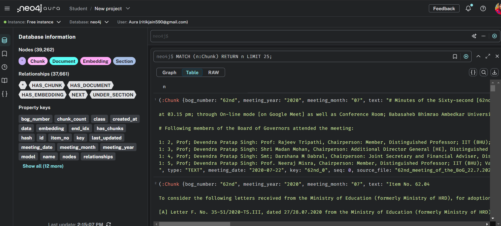

# 🤖 MNNIT BoG Assistant

An AI-powered chatbot that retrieves information from MNNIT Allahabad Board of Governors (BoG) meeting documents using Neo4j, RAG (Retrieval-Augmented Generation), and Groq's Llama 3 LLM.

---

## 🧠 Overview

The chatbot intelligently answers user queries like:

* What happened in the 75th BoG meeting?
* What was the resolution of Item No. 5.3?
* What did the board decide on 2023-06-21?

Unlike basic search tools, this chatbot performs:

* Smart chunking of official documents.
* Embedding + vector search using Neo4j.
* Response generation grounded on retrieved BoG context using Groq's Llama 3.

---

## 🚀 Features

### 👤 Users

* Ask questions using BoG number, Item number, or Meeting Date.
* Instant response with official resolution context.
* Beautiful and formal formatting in answers.

### 📄 Document Processing

* Parse .pdf and .docx minutes files using LlamaParse.
* Auto-chunk into Item-wise sections + summary.
* Store structured metadata in Neo4j (BoG number, date, item no, etc.).

### 📊 Vector Search & RAG

* SentenceTransformer generates chunk embeddings.
* Neo4j native vector index finds most relevant chunks.
* Prompt is constructed and sent to Groq (Llama3-70B) with context.
* Final response is grounded, formal, and detailed.

---

## 🛠️ Tech Stack

| Layer                           | Technology                              |
| ------------------------------- | --------------------------------------- |
| Frontend                        | React + TypeScript                      |
| Backend                         | Python (Flask or FastAPI), Google Colab |
| Knowledge Graph + Vector Search | Neo4j Aura DB                           |
| LLM                             | Groq (Llama 3 70B)                      |
| Embedding                       | SentenceTransformer (all-MiniLM-L6-v2)  |
| Parser                          | LlamaParse                              |

---

---

## 📷 Screenshots

### 📌 Chatbot Interface

### 🧠 Neo4j Graph View

### 🏗️ WorkFlow

---

## 🙌 Made With Love By Ritik Jain

  
🔗 [LinkedIn](https://www.linkedin.com/in/ritikjain00/) | ✉️ ritikjain590@gmail.com

